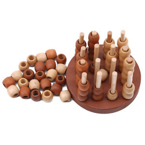

# ConnectFour 3D

This is a virtual 3D board game called "connect four 3D". In real life it looks
like this:



Note that 3D here has a double meaning: first of all, the board game itself has
"3D" in its name, since the players need to build a row of four tokens in any
of the three dimensions. And this project uses a 3D engine (this one:
[kiss3d](https://github.com/sebcrozet/kiss3d)) to implement a virtual version
of the game.

It happened that I and my relatives played it a lot, and I wanted to have a
virtual version of it, with network multiplayer, so we can play remotely.

There are some on the internet (e.g. this one:
https://www.kongregate.com/games/SaIG/connect-four-3d), but none that I know of
supports network multiplayer: either local human vs human, or human vs AI.

So here we go, I created one, with network multiplayer supported.

As a last note, keep in mind that this is my first ever Rust code, so give me a
break if the code isn't great. It's just a toy project that I implemented in
order to complement my theoretical knowledge from the book with some practice.

## Demo

Demo of the network game, with both clients running on the same machine. This
is not a typical use case obviously (network players would use different
machines), but just for the demo purposes.


## Usage

You obviously need Rust to build it and run:
https://www.rust-lang.org/tools/install.

You can run the game either in local mode (human-human on the local machine) or
network mode (human-human over the network). AI is not implemented (and no
plans to do that yet).

### Local mode

Local mode is when both human players are using the same computer. After
installing Rust and cloning the repo, run this from the repo root:

```
$ cargo run --bin connectfour-3d -- -o local
```

### Network mode

#### Using default server

As of May 2023, I'm running a server on my machine, and you can use it if you
want. No guarantees though as to whether I'll continue running it, etc.

To run in network mode, connecting to the default server (i.e. mine), to a game
called `mygame`:

```
$ cargo run --bin connectfour-3d -- -o network --game mygame
```

Once there are two players connected with the same game ID (in this case,
`mygame`), the game will start. If one of the players leaves (e.g. due to a
network issue, or whatever else), they can connect back and resume the game, as
long as the other player stays. When both players leave the game, the server
forgets it.

When the game is over (i.e. one of the players won), starting a new game is not
yet implemented in the UI. So just restart the app.

#### Using local server

You can run the server yourself, like this:

```
$ cargo run --bin server
...
Listening on: 0.0.0.0:7248
```

As you see, it listens on the port 7248.

And then, run the network client as described above, but also pass the flag
`--url ws://127.0.0.1:7248`:

```
$ cargo run --bin connectfour-3d -- -o network --url ws://127.0.0.1:7248 --game mygame
```
